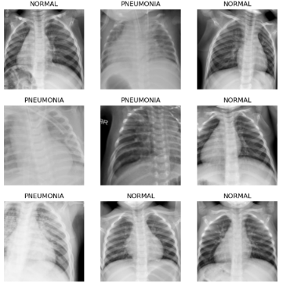

# PneumoDetect

[](https://www.fast.ai/)
[](https://pytorch.org/)
[](https://www.python.org/)
[](https://pypi.org/project/psutil/)

<p align="center">
  
</p>

## Project Overview

This project is aimed at developing a deep learning model to detect pneumonia from chest X-ray images using the Fastai library. The project uses a convolutional neural network (CNN) based on the ResNet34 architecture and leverages data augmentation techniques and transfer learning for improved performance.

## Dataset
You can download the dataset from Kaggle: https://www.kaggle.com/paultimothymooney/chest-xray-pneumonia/download
I have trained and saved the model: "model.pkl"

### Requirements

Ensure you have the following dependencies installed:
- fastai
- torch
- pandas
- numpy
- pathlib
- psutil

You can install these dependencies using pip:
```bash
pip install fastai torch pandas numpy pathlib psutil
```

## License

This project is licensed under the MIT License (https://github.com/harshaparida/PneumoDetect/blob/main/LICENSE).
